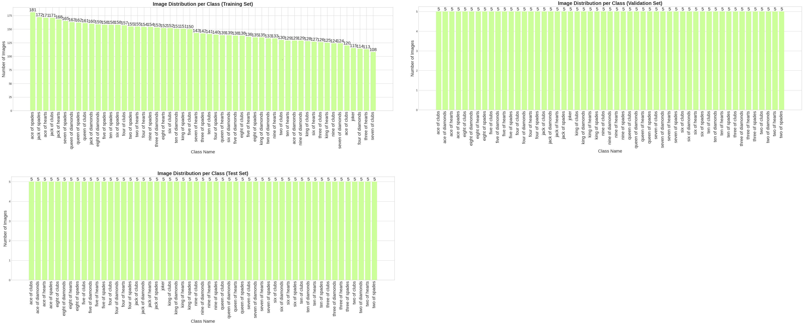

# Assignment 3: Image Data
*Group TN01 - Team SEML31*  

> **Colab Notebook:** 

## Overview
**Dataset:** [Cards Image Dataset](https://www.kaggle.com/datasets/gpiosenka/cards-image-datasetclassification?select=cards.csv)  
    + Image classification dataset.
    + Contains 8154 images of playing cards (52 standard cards + joker).  
- Given an image of a playing card, we need to classify it into one of the 53 distinct classes.
- **Multi-class classification model:**
    + **Input:** An RGB image of a playing card.
    + **Output:** The class label (e.g., 'ace of spades', 'queen of hearts', 'joker').

## Exploratory Data Analysis (EDA)

- The dataset is divided into Train, Validation, and Test sets.
- All images have a consistent shape of `(224, 224)` with 3 color channels (RGB).
- There are **53 classes** in total, covering all standard playing cards and the joker.

- Label distribution across the training, validation, and test sets

- Color distribution (RGB) across the dataset

## Choosing pretrained models
Using ResNet (resnet18/resnet34/resnet50) and EfficientNet (efficientnet_b0/efficientnet_b3) to extract feature and perform traning 
- ResNet18 architecture

- EfficientNet-B0 architecture

## Training result

We experimented with several state-of-the-art Convolutional Neural Network (CNN) architectures as the backbone for feature extraction, combined with different classifiers.

**Backbone Models:**
1.  **ResNet**: `resnet18`, `resnet34`, `resnet50`
2.  **EfficientNet**: `efficientnet_b0`, `efficientnet_b3`

**Classifiers & Configurations:**
1.  **Feature Extraction (Frozen Backbone)**: We trained simple classifiers on top of the extracted features.
    * **Logistic Regression** (L2 penalty)
    * **Random Forest** (n_estimators=150)
2.  **End-to-End Fine-tuning**: We fine-tuned the entire network with an **MLP** classifier attached.

**Results:**

The table below summarizes the performance (accuracy, precision, recall, and f1-score) of the various configurations.

| Base Model | Classifier | Config | Accuracy | Precision | Recall | F1-Score |
| :--- | :--- | :--- | :--- | :--- | :--- | :--- |
| **resnet18** | **MLP** | **end_to_end** | **0.9698** | **0.9766** | **0.9698** | **0.9696** |
| resnet50 | MLP | end_to_end | 0.9689 | 0.9764 | 0.9689 | 0.9686 |
| resnet34 | MLP | end_to_end | 0.9585 | 0.9666 | 0.9585 | 0.9582 |
| efficientnet_b3 | Logistic Regression | l2 | 0.6208 | 0.6353 | 0.6208 | 0.6141 |
| resnet50 | Logistic Regression | l2 | 0.6415 | 0.6488 | 0.6415 | 0.6295 |
| resnet18 | Random Forest | 150 | 0.3849 | 0.4224 | 0.3849 | 0.3691 |

The **ResNet18** model trained **end-to-end** with an **MLP** classifier achieved the highest performance with an F1-score of **0.9696**.

